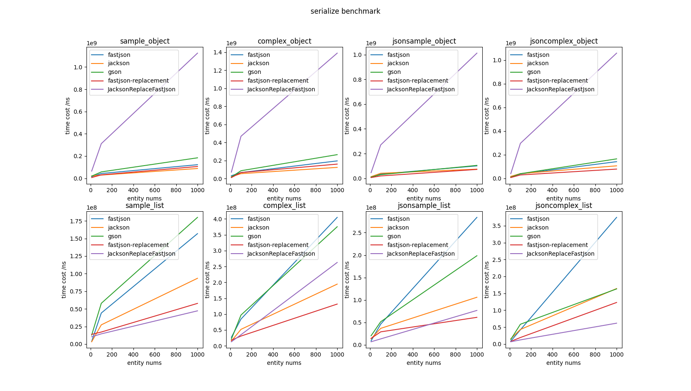
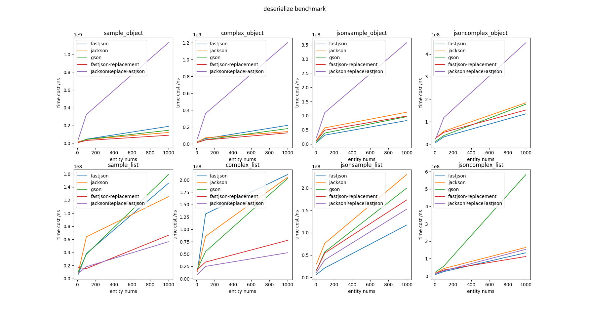

[中文文档](./README_CN.md) | [English Document](./README.md)

# Fastjson-replacement
[](https://codecov.io/gh/qingmo/fastjson-replacement) [](https://mit-license.org/) [](https://sonarcloud.io/dashboard?id=qingmo_fastjson-replacement) [](https://github.com/qingmo/fastjson-replacement/actions/workflows/codacy-analysis.yml) [](https://github.com/qingmo/fastjson-replacement/actions/workflows/build.yml)

Current version of `1.0.2` is product ready.
## What's `Fastjson-replacement`?
`Fastjson-replacement` is a Bridge Pattern for developers or lagency projects which are used to `Fastjson` usage to replace  
`Fastjson` implementation with `Jackson` implementation.

## Features
* support `java.util.Date`, `java 8 jsr310 time packages`(`LocalDate`,`LocalDateTime`,`LocalTime`)
* support multiple Date Format Deserialize（Current:`yyyy-MM-dd HH:mm:ss`,`yyyy-MM-dd`)

## Why

Why do we need replace `fastjson`? For it security issues, late of fix period and so on.

Why make new tools instead of using existing one? Because their bad tests(even in fastjson), and not auto publish after merged my pull requests that make me can not get new fix version from maven central repository.

## How to Use

**Step 1**: Add Dependencies

Use default `jackson`version（current version is:`1.12.3`) proivded by current lib.

`maven`

```xml
<dependency>
    <groupId>io.github.qingmo</groupId>
    <artifact>fastjson-replacement</artifact>
    <version>1.0.2</version>
</dependency>
```

`gradle`

```kotlin
implementation("io.github.qingmo:fastjson-replacement:1.0.2")
```


Use custom `jackson`version defined by user's project

`maven`

```xml
<dependency>
    <groupId>io.github.qingmo</groupId>
    <artifactId>fastjson-replacement</artifactId>
    <version>1.0.2</version>
    <exclusions>
        <exclusion>
            <groupId>com.fasterxml.jackson.core</groupId>
            <artifactId>jackson-databind</artifactId>
        </exclusion>
        <exclusion>
            <groupId>com.fasterxml.jackson.core</groupId>
            <artifactId>jackson-annotations</artifactId>
        </exclusion>
        <exclusion>
            <groupId>com.fasterxml.jackson</groupId>
            <artifactId>jackson-bom</artifactId>
        </exclusion>
    </exclusions>
</dependency>
```

`gradle`

```kotlin
implementation("io.github.qingmo:fastjson-replacement:1.0.2") {
    exclude(group = "com.fasterxml.jackson.core")
    exclude(group = "com.fasterxml.jackson")
}
```

**Step 2**: Replace `fastjson` packages

**Replace method**

```shell
import com.alibaba.fastjson.JSON
replace with
import io.github.qingmo.json.JSON

import com.alibaba.fastjson.JSONArray
replace with
import io.github.qingmo.json.JSONArray

import com.alibaba.fastjson.JSONObject
replace with
import io.github.qingmo.json.JSONObject
```

## What's the importance of the enterprise environment for an open-source library?

* **Reliability**

  The system/library must  work *correctly*. `Fastjson-replacement` provide functions with 100% tests coverage.

* **Performance**

  The system/library must perform the function at the desired level of performance. 
  if this library is the only solution to a problem, the performance should be at tolerant level;
  if this library is another solution to a problem, the performance should be equal to or better than the average level.

  `Fastjson-replacement` provide benchmark records as below(base on [json-comparsion](https://github.com/zysrxx/json-comparison)):

  

  

## Known Issues

* not support kotin data class

  kotlin data class need `jackson-module-kotlin` which depends on kotlin-reflect bad benchmark scores in deserialize.
  i'm waiting for https://github.com/FasterXML/jackson-module-kotlin/pull/439

## References
[jackson-datatype-fastjson](https://github.com/larva-zhang/jackson-datatype-fastjson/blob/master/src/test/java/com/github/larva/zhang/jackson/datatype/fastjson/SimpleReadTest.java)

[Jackson替换fastjson](https://www.cnblogs.com/larva-zhh/p/11544317.html)

[如何让jackson与kotlin友好相处](https://cloud.tencent.com/developer/article/1372442)

[jackson-replace-fastjson](https://github.com/zjb-it/jackson-replace-fastjson)

[Designing Data Intensive Applications](https://dataintensive.net/)

